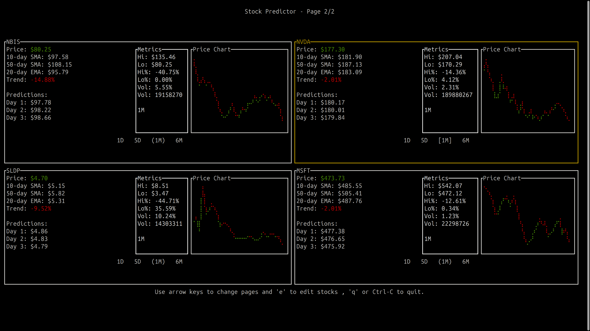
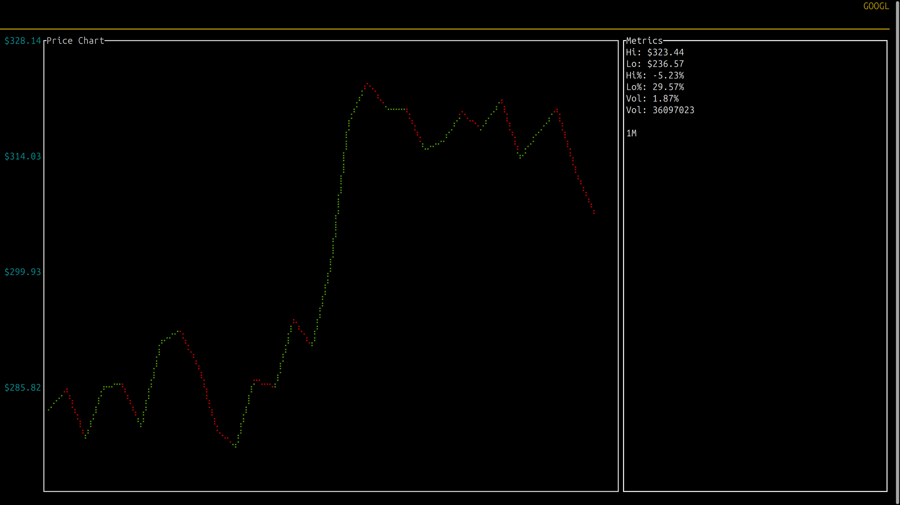
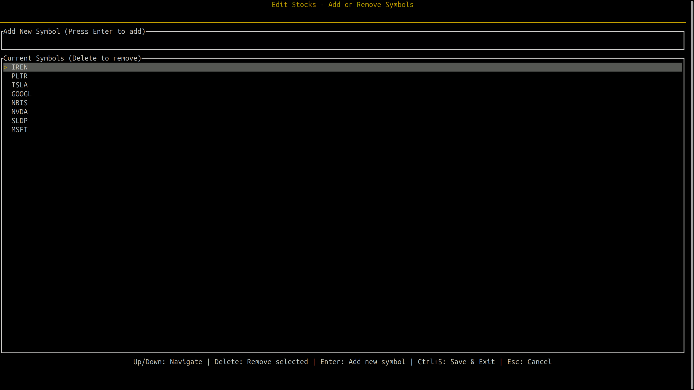

# bstock





A comprehensive, interactive terminal-based stock predictor written in Rust that fetches historical data from Yahoo Finance, performs analysis, and provides price predictions with a user-friendly TUI (Terminal User Interface).

## Features

- **Interactive TUI**: Full-screen terminal user interface with navigation and detailed views
- **Stock Analysis**: Fetches historical stock data from Yahoo Finance and calculates:
  - Simple Moving Average (SMA) 10/50-day
  - Exponential Moving Average (EMA) 20-day
  - Recent trend percentage
  - Price predictions for next days
- **Multiple Time Ranges**: View charts with different time ranges (1D, 5D, 1M, 6M)
- **Detailed View**: Rich detail view on stock selection with:
  - Price chart with Y-axis labels
  - Stock metrics and additional information
  - Stock symbol displayed prominently
- **Persistent Configuration**: Automatically persists stock configurations across app restarts
- **Configurable Stocks**: Load from persistent storage or specify via CLI
- **Stock Management**: Edit stocks using the 'e' key:
  - Add new stock symbols
  - Remove existing symbols
  - Save changes to persistent config
  - Automatic refresh after saving

## Installation

There are two ways to install bstock:

### Using Cargo
```bash
cargo install --git https://github.com/Not-Buddy/bstock
```

Or if published to crates.io:
```bash
cargo install bstock
```

### From Source
1. Ensure you have Rust installed (1.70 or later)
2. Clone the repository:
   ```bash
   git clone <repository-url>
   cd bstock
   ```

## Usage

### Basic Usage
```bash
# Use the default persistent configuration
cargo run

# Specify stocks and period via command line
cargo run -- -s AAPL GOOGL MSFT -p 90
```

### Command Line Options
- `-s, --symbols`: Specify stock symbols to analyze (e.g., `AAPL GOOGL`)
- `-p, --period`: Set analysis period in days (default: 90)

### Navigation
- **Left/Right Arrow Keys**: Navigate between stocks
- **Up/Down Arrow Keys**: Change time range in main view, navigate in edit mode
- **Enter**: View detailed stock information
- **Escape**: Return to main view from detail view
- **'e' Key**: Enter stock editing mode
- **'q' or Ctrl+C**: Quit the application

### Stock Editing Mode
When in editing mode (press 'e'):
- Type stock symbol and press **Enter** to add
- Use **Up/Down** arrows to select existing symbols
- Press **Delete** to remove selected symbol
- Press **Ctrl+S** to save changes to persistent config
- Press **Escape** to exit editing mode
- The app automatically refreshes with new stocks after saving

## Configuration

Stocks are managed through a persistent configuration system that stores settings in your system's standard config directory (as an internal JSON file):

- On Linux: `~/.config/bstock/config.json`
- On macOS: `~/Library/Application Support/com.bstock.bstock/config.json`
- On Windows: `C:\Users\<username>\AppData\Roaming\bstock\config.json`

The application automatically manages this configuration file. You can modify stocks through:
- Command-line arguments when launching the application
- The built-in editor (press 'e' key while running)

The default configuration includes these stock symbols:
`PLTR`, `NBIS`, `GOOGL`, `NVDA`, `MSFT`, `TSLA`, `SLDP`, `IREN`

Command-line options will override the persistent config temporarily, but changes made in the editor will update the saved configuration.

## Requirements

- Rust 1.70+
- Internet connection (to fetch stock data from Yahoo Finance)
- Terminal that supports color output

## Architecture

The application is structured as:
- **Main Application**: Core logic and state management
- **UI Module**: TUI rendering with ratatui
- **Data Module**: Time range handling and data processing
- **Event System**: Asynchronous stock data fetching
- **Config Module**: Stock configuration management
- **Persistence Module**: Persistent configuration storage across app restarts
- **Analysis Module**: Technical analysis calculations

## Dependencies

- `ratatui`: Terminal user interface framework
- `crossterm`: Cross-platform terminal handling
- `tokio`: Async runtime for concurrent data fetching
- `serde_json`: JSON configuration handling
- `clap`: Command line argument parsing
- `yahoo_finance_api`: Yahoo Finance data fetching
- `directories`: Cross-platform config directory management
- `ndarray`: Numerical computations for predictions

## Performance

- Async data fetching for all configured stocks
- Efficient terminal rendering
- Responsive UI with non-blocking operations
- Automatic refresh after configuration changes
- Persistent configuration reduces startup time

## Contributing

1. Fork the repository
2. Create a feature branch
3. Make your changes
4. Submit a pull request

## License

This project is licensed under the MIT License - see the [LICENSE](LICENSE) file for details.